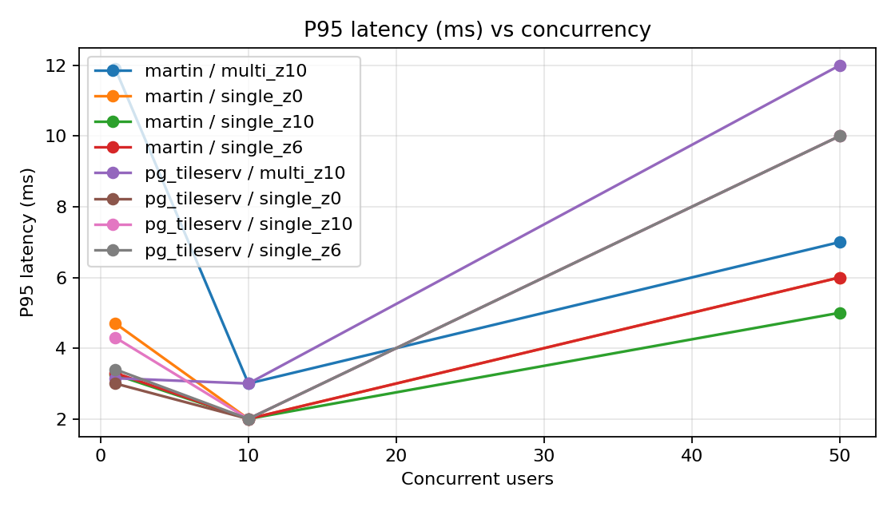
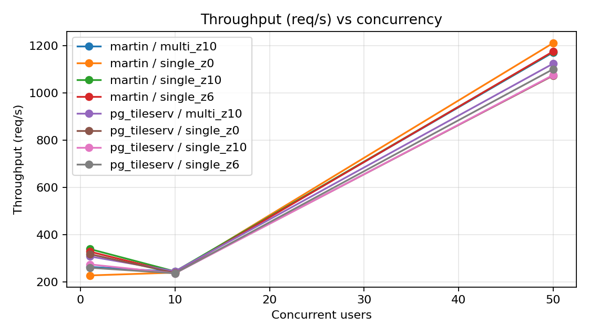

# GeoService-TestLab

**Automated Testing & Performance Benchmarking for Geospatial Services**

[](https://github.com/alexa0030/GeoService-TestLab/actions/workflows/test.yml)

Python · pytest · Docker Compose · PostGIS · JMeter · GitHub Actions

GeoService-TestLab is a reproducible test-development demo for vector-tile
services. It connects an urban–rural spatial-data use case with API automation,
regression testing, performance measurement and CI.

```text
                 pytest / JMeter
                       |
                 HTTP requests
                       |
          +------------+------------+
          |                         |
       Martin                  pg_tileserv
          |                         |
          +------------+------------+
                       |
                PostgreSQL/PostGIS
```

## Quick start

Prerequisites: Docker Desktop, Docker Compose v2, Python 3.10+.

```bash
git clone <your-repository-url>
cd GeoService-TestLab
python -m venv .venv
source .venv/bin/activate  # Windows PowerShell: .venv\Scripts\Activate.ps1
pip install -r requirements.txt
docker compose up -d
python scripts/wait_for_services.py
```

Run the complete API suite:

```bash
RUN_INTEGRATION=1 pytest -v
# PowerShell: $env:RUN_INTEGRATION=1; pytest -v
```

Without Docker, `pytest -v -m "not integration"` runs the local unit suite.

## Test design

The suite uses a shared client, pytest fixtures and parameterization. It covers:

- service/catalog availability;
- valid vector tiles at multiple zoom levels;
- status, content type and binary payload checks;
- invalid zoom/x inputs and unknown layers;
- repeatable core API responses;
- the same layer through Martin and pg_tileserv.

See [the test plan](docs/test_plan.md) and [case matrix](docs/test_cases.md).

## Performance benchmark

With Apache JMeter 5.6.3 installed:

```bash
bash scripts/run_performance.sh
```

The plans execute **24 benchmark groups**: two services × four tile scenarios
(z0, z6, z10 and four-tile z10) × three concurrency levels (1/10/50). The
Python analyzer reads real JMeter JTL/CSV output and creates:

- `reports/jmeter/summary.csv` (samples, average, P95, throughput, error rate);
- `reports/figures/latency_vs_concurrency.png`;
- `reports/figures/throughput_vs_concurrency.png`.

The committed [benchmark summary](reports/benchmark_summary.csv) comes from a
successful GitHub-hosted Ubuntu runner execution of Apache JMeter 5.6.3.

| Scenario (50 users) | Martin P95 | pg_tileserv P95 | Martin req/s | pg_tileserv req/s |
|---|---:|---:|---:|---:|
| Multi tile, z10 | 7 ms | 12 ms | 1,172.33 | 1,124.86 |
| Single tile, z0 | 6 ms | 10 ms | 1,212.12 | 1,074.11 |
| Single tile, z6 | 6 ms | 10 ms | 1,176.47 | 1,101.32 |
| Single tile, z10 | 5 ms | 10 ms | 1,175.09 | 1,076.43 |

Across those four 50-user scenarios, Martin averaged **6.0 ms P95** versus
**10.5 ms** for pg_tileserv (42.9% lower), and **1,184.0 req/s** versus
**1,094.18 req/s** (8.2% higher). All **9,760 samples** across the complete
24-group matrix completed with **0% errors**. These figures describe one small
dataset on one shared CI runner and are comparative evidence, not universal
capacity claims.





## Current verification status

The verified GitHub Actions run completed both jobs successfully:

- local/unit selection: **7 passed**;
- Docker-backed complete suite: **29 passed**;
- PostGIS, Martin and pg_tileserv: started and queried successfully;
- JMeter benchmark: **24 groups / 9,760 samples / 0% errors**;
- performance workflow: completed successfully in 2m15s on GitHub Actions.

GitHub Actions runs both suites on every push and pull request.

## Failure analysis

The first engineered risk is service startup ordering: a database container can
exist before it is ready for connections. Compose checks `pg_isready`, and the
Python runner additionally polls both HTTP catalogs. See
[failure analysis](docs/failure_analysis.md). Observed runtime issues should be
added there with logs and fixes, not invented in advance.

## Project structure

```text
config/       service and test settings
data/         publishable GeoJSON and database initialization
src/          API client, configuration and logging
tests/        unit, API, boundary and regression tests
performance/  JMeter plans and scenarios
analysis/     result summarization and comparison
scripts/      environment, test and benchmark runners
docs/         architecture, plan, cases and failure analysis
.github/      CI workflow
```

## Reference

Inspired by
[FabianRechsteiner/vector-tiles-benchmark](https://github.com/FabianRechsteiner/vector-tiles-benchmark).
This project keeps the PostGIS → vector-tile service → JMeter benchmark idea
and adds Python API automation, boundary and regression tests, CI, startup
readiness checks and automated result analysis. It is an independent testing
demo and does not copy the original benchmark implementation.

## License

MIT
